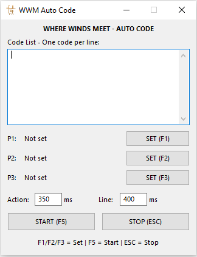
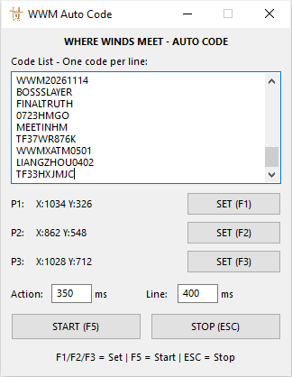
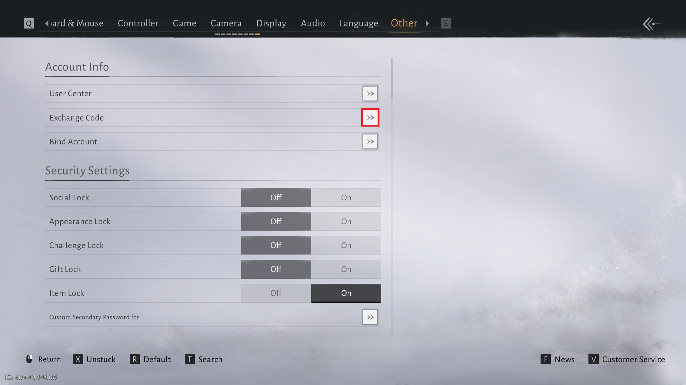
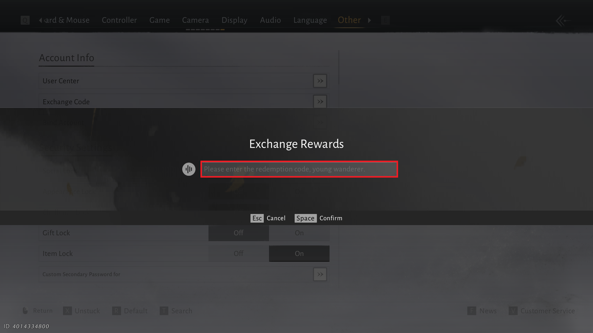
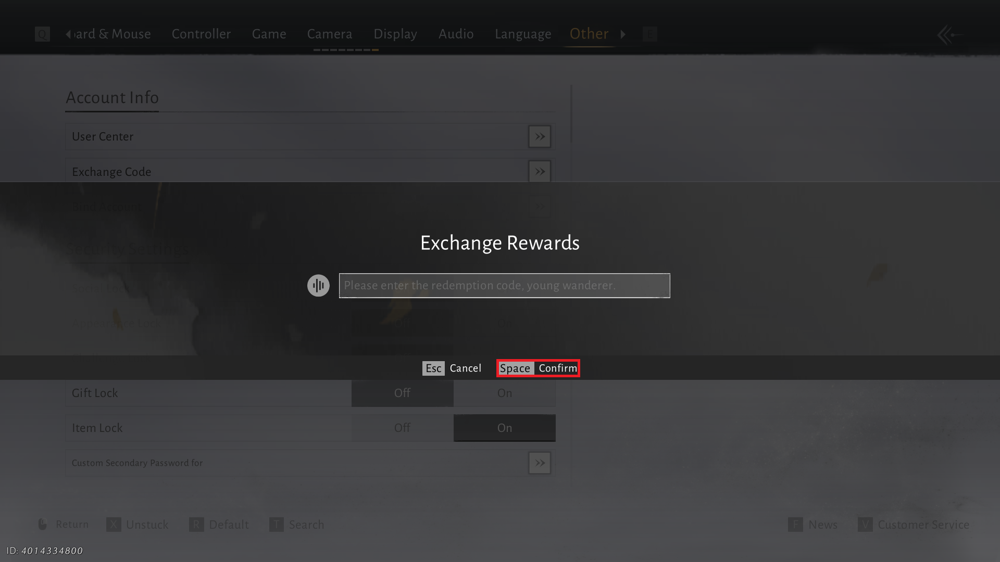

# WhereWindsMeet-AutoCode

AutoHotkey v2 tool to auto-redeem a list of _Where Winds Meet_ gift codes via 3 clickable points + P1 color detection to handle success/error popups.

[](https://www.autohotkey.com/)



> Fresh start — Code List empty, P1/P2/P3 `Not set`. Set points with F1/F2/F3, they persist in `WWM_AutoCode.ini`.

---

## How it works

For each code in the list:

```text
P1 → P2 → Ctrl+A + Paste code → P3 (confirm) → check P1 color
```

- **P1 color back to normal** → popup closed, next code starts from **P1**.
- **P1 color changed** (result popup still open) → next code skips P1, starts directly at **P2**.

Points are saved as game-client coordinates in `WWM_AutoCode.ini`, so the game window can be moved between sessions without re-setting points (resolution change still requires re-setting).

| Point | Purpose | Hotkey |
| ----- | ------- | ------ |
| P1 | Open redeem screen (reference color is also captured here) | F1 |
| P2 | Code input box (tool does Ctrl+A + Ctrl+V here) | F2 |
| P3 | Confirm / submit button | F3 |

| Control | Action |
| ------- | ------ |
| F1 / F2 / F3 | Set P1 / P2 / P3 at current mouse position (game must be focused) |
| F5 / START | Start automation |
| ESC / STOP | Stop automation (while running, ESC is captured; when idle, ESC is a normal game key) |
| Action ms | Delay after each click / paste (default 350) |
| Line ms | Extra delay between codes (default 400) |

---

## Download & Setup

**Option A — Standalone executable (recommended)**

1. Download `WhereWindsMeet-AutoCode.exe` from [Releases](../../releases/latest).
2. Right-click `WhereWindsMeet-AutoCode.exe` → **Run as administrator**.

**Option B — Run the script directly**

1. Install [AutoHotkey v2](https://www.autohotkey.com/).
2. Right-click `WhereWindsMeet-AutoCode.ahk` → **Run as administrator**.

> Administrator is required for pixel color detection, mouse clicks and clipboard paste to reach the game.

---

## Usage

1. Open the game **Where Winds Meet**, go to Settings → Other → Account Info.
2. In the tool, paste your code list into **Code List — one code per line** (see [Code List](#code-list) below).
3. Set the 3 points:
   - Hover the redeem menu button → press **F1** (P1).
   - Hover the code input box → press **F2** (P2).
   - Hover the confirm button → press **F3** (P3).
   - You can also click **SET (F1/F2/F3)** in the tool — it focuses the game, then you move the mouse and press the matching F-key.
4. Tune **Action** / **Line** delays if needed (higher = more stable, slower).
5. Press **START (F5)**. The tool focuses the game and runs through all codes.
6. Press **ESC** to stop at any time.

Points persist in `WWM_AutoCode.ini` next to the script/exe — set once, reuse next time.

---

## Code List

Paste codes into the **Code List** box — **one code per line**. Empty lines are skipped.



> Screenshot shows 9 sample codes filled in with points set (e.g. P1 X:1034 Y:326, P2 X:862 Y:548, P3 X:1028 Y:712). Points can be set before or after pasting codes.

Example:

```text
WWM20261114
BOSSSLAYER
FINALTRUTH
0723HMGO
MEETINHM
TF57WR876K
WWMXATM0501
LIANGZHOU0402
TF33HXMJIC
```

---

## Setup Points with screenshots

### P1 — Redeem menu button (F1)

Settings → Other → **Account Info** → **Exchange Code** → click the `>>` button. Set P1 on this button. Its color is captured as the "normal" reference.



### P2 — Code input box (F2)

After P1, the **Exchange Rewards** dialog opens. Set P2 inside the input box (`Please enter the redemption code, young wanderer.`). The tool selects all + pastes each code here.



### P3 — Confirm button (F3)

Set P3 on the **Space Confirm** button to submit each code.



---

## Tuning

Edit at the top of `WhereWindsMeet-AutoCode.ahk` if the default timing is too fast/slow for your PC:

- `DEFAULT_ACTION_DELAY` — delay after each click/paste (default 350 ms).
- `DEFAULT_LINE_DELAY` — delay between codes (default 400 ms).
- `COLOR_TOLERANCE` — RGB tolerance for P1 color match (default 30).
- `COLOR_INITIAL_WAIT` / `COLOR_CHECK_TIMEOUT` / `COLOR_CHECK_INTERVAL` — how long to wait for P1 to return to normal after submit (350 / 1200 / 100 ms).

---

## Disclaimer

This tool automates mouse clicks and keyboard inputs for _Where Winds Meet_. Use it at your own risk. Automation may violate the game's Terms of Service and could result in account penalties. The author is not responsible for any consequences arising from its use.

---

## License

MIT — see [LICENSE](LICENSE).
